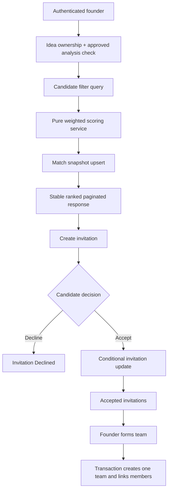

# Phase 2: Matching Engine & Invitations - Research

**Researched:** 2026-09-05  
**Domain:** MongoDB/Mongoose candidate matching, invitations, and team formation  
**Confidence:** HIGH for repository contracts; MEDIUM for product-policy assumptions

## Summary

Phase 2 should extend the existing authenticated Express API rather than create a parallel candidate or idea model. Candidate data already lives in `User`; approved matching requirements live in `Idea.aiAnalysis.rolesAndSkills`; the existing `Match` model provides a starting persistence boundary but does not yet store the full explanation or scoring inputs. [VERIFIED: codebase read]

The safest MVP shape is a pure deterministic scoring service fed by normalized idea requirements and candidate profiles, followed by a paginated controller that persists one match snapshot per idea/candidate. Invitations should be a separate lifecycle from matches, and teams should be created explicitly by the founder from accepted invitations. The acceptance and team-formation writes need conditional updates, unique indexes, and a MongoDB transaction when multiple documents must change atomically. [CITED: https://www.mongodb.com/docs/manual/core/transactions/] [CITED: https://mongoosejs.com/docs/transactions.html]

**Primary recommendation:** implement scoring and explanation in a side-effect-free service, expose one idea-scoped ranked search contract, use an `Invitation` model with explicit status transitions, and create one team per idea for the V1 MVP.

<phase_requirements>

## Phase Requirements

| ID   | Description                             | Research Support                                                                                                           |
| ---- | --------------------------------------- | -------------------------------------------------------------------------------------------------------------------------- |
| F4.1 | Search and filter candidates            | Existing `User` profile fields, `$all` for must-have skills, indexed filters, pagination and deterministic tie-breaking    |
| F4.2 | Calculate transparent 0-100 match score | Weighted pure function and persisted score/explanation snapshot                                                            |
| F4.3 | Display ranked matches                  | Stable `/api/candidates/search/with-scores` response contract with score, matched/missing skills, and actions              |
| F5.1 | Send invitation                         | `Invitation` document, founder authorization, duplicate/pending policy, and match context snapshot                         |
| F5.2 | Accept/decline invitation               | Candidate-only conditional status transition with idempotent response behavior                                             |
| F5.3 | Form team                               | Founder-only explicit form endpoint, accepted-invitation validation, one-team-per-idea invariant, and transaction strategy |

</phase_requirements>

## User Constraints

- Phase scope is candidate search and ranking, deterministic weighted match score, invitations and acceptance workflow, and team formation. [VERIFIED: `.planning/ROADMAP.md`]
- Preserve Phase 1 contracts using `User`, `Idea.createdBy`, and inline `Idea.aiAnalysis`. [VERIFIED: `.planning/phases/01-backend-foundation/01-01-SUMMARY.md`]
- Do not add production code as part of research. [VERIFIED: user request]
- V1 is a small MongoDB/Express MVP with Firebase authentication and no advanced analytics, chat, real-time notification delivery, or external candidate search. [VERIFIED: `.planning/PROJECT.md`, `.planning/REQUIREMENTS.md`]

## Architectural Responsibility Map

| Capability                    | Primary Tier       | Secondary Tier     | Rationale                                                                                    |
| ----------------------------- | ------------------ | ------------------ | -------------------------------------------------------------------------------------------- |
| Candidate filtering           | API / Backend      | Database / Storage | The API owns authorization and query construction; MongoDB executes indexed filters.         |
| Match scoring and explanation | API / Backend      | —                  | The weighted formula is business logic and must be shared by search, persistence, and tests. |
| Match snapshot persistence    | Database / Storage | API / Backend      | MongoDB provides audit history while the controller decides when to refresh it.              |
| Invitation lifecycle          | API / Backend      | Database / Storage | Controllers enforce actor and state-transition rules; MongoDB conditionally persists them.   |
| Team membership invariant     | Database / Storage | API / Backend      | Unique keys and transaction boundaries protect against concurrent acceptance/form requests.  |
| Ranked match display contract | API / Backend      | Browser / Client   | Backend returns stable, explainable data; the Phase 3 React UI renders it.                   |

## Existing System Contracts

### Models

| Model      | Current contract                                                                                                                                                      | Phase 2 use                                                                                                                                                                                          |
| ---------- | --------------------------------------------------------------------------------------------------------------------------------------------------------------------- | ---------------------------------------------------------------------------------------------------------------------------------------------------------------------------------------------------- |
| `User`     | `profileType`, `profileCompleted`, `skills[{name, level}]`, `targetRoles`, `domainInterests`, `availability`, `hoursPerWeek`, `workPreference`, `college`, `location` | Candidate source and scoring input. Query only `profileType: 'candidate'` and `profileCompleted: true`. [VERIFIED: `backend/models/User.js`]                                                         |
| `Idea`     | `createdBy`, `status`, inline `aiAnalysis.rolesAndSkills[{role, skills, priority, count, experienceLevel}]`, approval flags                                           | Source of truth for matching requirements. Only approved analysis should be scored for the public/founder matching flow. [VERIFIED: `backend/models/Idea.js`, `backend/controllers/aiController.js`] |
| `Analysis` | Normalized history model keyed by `ideaId` and `founderId`                                                                                                            | Optional history/audit source; do not make Phase 2 depend on it because Phase 1 reads inline `Idea.aiAnalysis`. [VERIFIED: `backend/models/Analysis.js`, Phase 1 summary]                            |
| `Match`    | Unique `{ideaId,userId}`, `matchedSkills`, `matchScore`, `locationMatch`, and `status` enum `pending/accepted/rejected`                                               | Extend with candidate-facing explanation and scoring version. Do not use its status as invitation status; the concepts have different actors and transitions. [VERIFIED: `backend/models/Match.js`]  |

### Routes and authentication

- All existing protected routes use Firebase Bearer-token verification and resolve the MongoDB user by `firebaseUid`. [VERIFIED: `backend/middleware/authMiddleware.js`, `backend/controllers/userController.js`]
- Current candidate search is `POST /api/users/candidates/search`, accepts filters in the request body, uses `$in`, and sorts by `createdAt`. It does not yet calculate scores or enforce all must-have skills. [VERIFIED: `backend/routes/userRoutes.js`, `backend/controllers/userController.js`]
- Existing idea discovery is `GET /api/ideas/discover` and returns approved ideas with statuses `analyzed`, `matching`, or `team-forming`. [VERIFIED: `backend/controllers/ideaController.js`]
- Existing public profile projection excludes private fields such as email and Firebase UID; Phase 2 responses should use the same privacy principle. [VERIFIED: `backend/controllers/userController.js`]

## Standard Stack

### Core

| Library        | Version   | Purpose                                  | Why Standard                                                                                                                                                    |
| -------------- | --------- | ---------------------------------------- | --------------------------------------------------------------------------------------------------------------------------------------------------------------- |
| Express        | `^5.2.1`  | REST routes/controllers                  | Already mounted in `backend/server.js`; preserve the current route/controller convention. [VERIFIED: `backend/package.json`]                                    |
| Mongoose       | `^9.9.3`  | Schemas, indexes, sessions, transactions | Existing persistence layer and documented transaction helper support. [VERIFIED: `backend/package.json`] [CITED: https://mongoosejs.com/docs/transactions.html] |
| Firebase Admin | `^14.2.0` | Request authentication                   | Existing `authenticateUser` middleware is the identity boundary. [VERIFIED: `backend/package.json`, `backend/middleware/authMiddleware.js`]                     |

### Supporting

| Library           | Version          | Purpose                                        | When to Use                                                                                                                                                                         |
| ----------------- | ---------------- | ---------------------------------------------- | ----------------------------------------------------------------------------------------------------------------------------------------------------------------------------------- |
| Node.js built-ins | Existing runtime | Pure scoring service and normalization helpers | Use for the deterministic algorithm; no package is needed. [VERIFIED: `backend/package.json`]                                                                                       |
| Zod               | `^4.5.4`         | Optional request-shape validation              | Already installed, but Phase 2 may continue the repository's lightweight middleware style unless stronger validation is needed. [VERIFIED: `backend/package.json`, Phase 1 summary] |

No new package installation is recommended for this phase. Package legitimacy audit is therefore not applicable.

## Recommended Architecture



### Recommended project structure

```text
backend/
├── models/
│   ├── Match.js              # Extend snapshot fields and indexes
│   ├── Invitation.js         # New lifecycle model
│   └── Team.js               # New idea/team model
├── services/
│   └── matchScoring.js       # Pure normalization, scoring, explanation
├── controllers/
│   ├── matchingController.js
│   ├── invitationController.js
│   └── teamController.js
├── routes/
│   ├── matchingRoutes.js
│   ├── invitationRoutes.js
│   └── teamRoutes.js
└── middleware/
    └── validationMiddleware.js # Extend existing ID/request checks
```

## Matching Design

### Inputs and normalization

1. Read `Idea.aiAnalysis.rolesAndSkills` only when `isApproved === true`; reject or return a clear `409`/`400` for an unapproved or missing analysis. [ASSUMED: the API should block matching before approval because Phase 1 changes the idea to `matching` only on approval; confirm exact status policy during planning.]
2. Flatten role requirements into distinct normalized skill requirements while retaining each skill's priority, required role, count, and experience level.
3. Normalize comparison keys with trim plus case-insensitive matching. Preserve canonical display labels from the stored taxonomy. Deduplicate candidate skills and idea skills before scoring.
4. Treat `skills` as `{name, level}` objects, not strings. Candidate search on a skill name must use `skills.name` and, if level is required, `$elemMatch` so name and level apply to the same embedded skill. [VERIFIED: `backend/models/User.js`]

### Deterministic formula

Use the approved weights exactly as specified in F4.2:

```text
skillsContribution      = skillsMatchScore * 0.40
levelContribution       = levelCompatibility * 0.15
roleContribution        = roleMatch * 0.15
domainContribution      = domainMatch * 0.15
availabilityContribution = availabilityCompatibility * 0.15
totalScore              = roundToTwoDecimals(sum of contributions)
```

Recommended component rules:

- `skillsMatchScore`: `(matched must-have skills / total must-have skills) * 100`. If there are no must-have skills, use `100` so the component is neutral rather than dividing by zero. Nice-to-have skills are explanation-only and do not affect the score or tie-breaker in V1. [RESOLVED: product decision]
- `levelCompatibility`: `1.0` when the candidate has at least the required level for the relevant skill/role, `0.5` when one level below, otherwise `0`. If multiple required levels exist, use the best relevant candidate skill level and average the required role components. [ASSUMED: exact multi-role aggregation needs product confirmation.]
- `roleMatch`: `1.0` when the candidate's `targetRoles` contains the offered/required role, otherwise `0.0`.
- `domainMatch`: `1.0` when `Idea.domain` or approved analysis domain appears in `domainInterests`, otherwise `0.0`.
- `availabilityCompatibility`: `1.0` when availability and hours meet the requirement, `0.5` for a partial/unknown fit, otherwise `0.0`. Because current `Idea` has no explicit hours or work-mode requirement, the V1 fallback is exactly `0.5` unknown; do not invent idea requirements. [VERIFIED: `backend/models/Idea.js`] [RESOLVED: product decision]

The service must return both numeric components and explanation data:

```js
{
  score: 82.5,
  matchedSkills: ['Node.js', 'MongoDB'],
  missingSkills: ['REST API'],
  niceToHaveSkills: ['Docker'],
  sharedDomains: ['EdTech'],
  roleMatches: ['Backend Developer'],
  components: {
    skills: 26.67,
    level: 15,
    role: 15,
    domain: 15,
    availability: 10
  },
  scoringVersion: 'v1'
}
```

Round only the final displayed/persisted score to two decimals; use unrounded component values for the total. Sort by `score: -1`, then `createdAt: -1`, then `_id: 1` to guarantee repeatable pagination when scores tie. [ASSUMED: tie-break order is a recommended implementation choice.]

### Search contract

Prefer a GET endpoint matching the requirements while retaining the existing POST endpoint temporarily for compatibility:

`GET /api/candidates/search/with-scores?ideaId=<id>&skills=Node.js,React&level=Intermediate&domain=EdTech&workMode=hybrid&availability=part-time&page=1&limit=10&minScore=40&sort=best`

Recommended response:

```json
{
  "success": true,
  "matches": [
    {
      "matchId": "...",
      "candidate": {
        "id": "...",
        "name": "...",
        "profileImage": "...",
        "skills": [],
        "targetRoles": [],
        "domainInterests": [],
        "availability": "part-time",
        "workPreference": "hybrid"
      },
      "score": 82.5,
      "explanation": {
        "matchedSkills": [],
        "missingSkills": [],
        "sharedDomains": [],
        "roleMatches": [],
        "components": {}
      },
      "invitationStatus": null
    }
  ],
  "pagination": { "page": 1, "limit": 10, "total": 1, "totalPages": 1 }
}
```

Use `$all` when a caller explicitly requests all named skills; MongoDB documents `$all` as equivalent to an AND over the listed values. Use `$in` only for any-match filters such as domain, role, or availability. [CITED: https://www.mongodb.com/docs/manual/reference/operator/query/all/] [CITED: https://www.mongodb.com/docs/manual/reference/operator/query/in/]

## Schema and API Design

### Match extension

Extend `Match` with `candidateId` only if the team uses that naming consistently; otherwise retain `userId` as the candidate reference to avoid a needless migration. Add:

- `explanation`: matched/missing/nice-to-have skills, shared domains, role matches, and numeric components.
- `scoringVersion`: required for auditability when weights change.
- `requirementsSnapshot`: normalized requirements used for this calculation.
- `calculatedAt` and `refreshedAt` (timestamps already exist; use them deliberately).
- Keep the existing unique `{ideaId, userId}` index and add `{ideaId, matchScore: -1, _id: 1}` for ranked retrieval. [ASSUMED: index ordering should be confirmed with `explain()` against the target dataset.]

### Invitation model

Recommended fields:

```text
ideaId: ObjectId ref Idea, required
fromFounder: ObjectId ref User, required
toCandidate: ObjectId ref User, required
role: String, required
message: String, optional, length-limited
matchId: ObjectId ref Match, optional
matchContext: { score, matchedSkills, missingSkills, scoringVersion }, snapshot
status: Pending | Accepted | Declined | Withdrawn
respondedAt: Date, optional
withdrawnAt: Date, optional
createdAt/updatedAt: timestamps
```

Use a unique `{ideaId, toCandidate}` index for one current invitation record per idea/candidate. A resend after `Declined` reopens that same record in place as `Pending` and updates the snapshot; no attempt/history collection is in V1.

Endpoints:

- `POST /api/invitations`: founder only; verify owned idea, candidate profile, approved/matching idea, and no existing accepted/team membership. Return `201` or `409` for an already pending/accepted invitation.
- `GET /api/invitations?direction=received|sent&status=Pending`: authenticated user sees only invitations addressed to or sent by them.
- `GET /api/invitations/:id`: only sender or recipient; populate safe idea/founder/candidate projections.
- `PUT /api/invitations/:id/accept`: candidate only; conditional `Pending -> Accepted` update.
- `PUT /api/invitations/:id/decline`: candidate only; conditional `Pending -> Declined` update.
- `PUT /api/invitations/:id/withdraw`: founder only; conditional `Pending -> Withdrawn` update.

Return `409` for stale state transitions. Repeating the same accept/decline request should return the current state only if it is the same terminal action; do not silently reverse a terminal state. [ASSUMED: idempotency behavior is recommended for UI retries.]

### Team model

For V1, create one `Team` per idea:

```text
ideaId: ObjectId ref Idea, required, unique
founderId: ObjectId ref User, required
name: String, required
members: [{ userId: ObjectId ref User, role: String, invitationId: ObjectId ref Invitation, joinedAt: Date }]
status: Active | Archived
createdAt/updatedAt: timestamps
```

Endpoints:

- `POST /api/teams`: founder only; input `{ideaId, name}`; require owned idea and at least one accepted invitation; create the team from accepted invitations.
- `GET /api/teams/:id`: authenticated founder/member only; return safe member profiles.
- `GET /api/teams`: list teams where `founderId` matches or `members.userId` contains the current user.

A unique `ideaId` makes the roadmap's one-team-per-startup MVP explicit and prevents two simultaneous team records for one idea. If the product later permits multiple teams per idea, replace this with a canonical `TeamMembership` collection and unique `{ideaId, candidateId}` membership index; do not rely on an array-only uniqueness rule. [ASSUMED: one team per idea is the intended V1 interpretation of “form team”.]

## Transaction and Concurrency Risks

1. **Two accepts for the same invitation:** use `findOneAndUpdate({ _id, toCandidate, status: 'Pending' }, { $set: { status: 'Accepted', respondedAt } }, { new: true })`; a null result means the invitation was already handled.
2. **Two founders form the same idea:** unique `Team.ideaId` plus a transaction converts the race into one success and one `409`.
3. **Candidate accepted in competing teams:** V1 scopes the active-team invariant to the same founder and idea. Candidates may participate in teams for different founders/ideas; do not add a global active-membership constraint.
4. **Invitation created after a candidate is already accepted:** query current invitation/team state and enforce the same condition at write time; never trust a prior search result.
5. **Match snapshot staleness:** profile or approved analysis edits make persisted scores stale. Store `scoringVersion`, `calculatedAt`, and a requirements snapshot; expose refresh/recalculation as an explicit operation or refresh on idea-scoped search.
6. **Transaction deployment:** MongoDB transactions require a replica set or sharded deployment with an adequate feature compatibility version; Atlas normally supplies this, but local standalone MongoDB may not. Before transaction integration tests, check Atlas/deployment transaction capability. If unavailable, tests must skip clearly with the environment reason and must not report a false pass. [CITED: https://www.mongodb.com/docs/manual/core/transactions/]
7. **Mongoose session discipline:** every read/write intended to be atomic must receive the same session; do not use `Promise.all` inside the transaction. [CITED: https://mongoosejs.com/docs/transactions.html]

Recommended form-team transaction sequence: load/lock the owned idea context, read accepted invitations with the session, insert the team with `ideaId`, update accepted invitations with `teamId`, and commit. Passing an invitation acceptance does not create a Team: acceptance reserves the candidate and returns `teamAssignment: { status: 'accepted', teamId: null }` until the founder calls `POST /api/teams`. Pass the session to every operation and catch duplicate-key errors as a conflict. [CITED: https://mongoosejs.com/docs/transactions.html] [CITED: https://www.mongodb.com/docs/manual/core/index-unique/]

## Don't Hand-Roll

| Problem                              | Don't Build                                    | Use Instead                                                 | Why                                                                                                                                              |
| ------------------------------------ | ---------------------------------------------- | ----------------------------------------------------------- | ------------------------------------------------------------------------------------------------------------------------------------------------ |
| Atomic multi-document team creation  | Ad hoc sequential writes with rollback guesses | Mongoose `connection.transaction()` / session transaction   | MongoDB provides atomic commit/abort and retry behavior for transient transaction errors. [CITED: https://mongoosejs.com/docs/transactions.html] |
| Duplicate invitation/team prevention | In-memory locks or pre-check-only logic        | Unique indexes plus conditional updates                     | Pre-checks race; database constraints arbitrate concurrent requests. [CITED: https://www.mongodb.com/docs/manual/core/index-unique/]             |
| Skill matching semantics             | String substring/fuzzy matching in controllers | Canonical taxonomy values plus normalized set comparison    | Existing taxonomies are exact labels and scoring must be deterministic. [VERIFIED: `backend/config/taxonomies.js`]                               |
| Ranking                              | MongoDB-only opaque score expressions          | Tested pure JavaScript scoring service, then persist result | Explanation and formula behavior remain reviewable and unit-testable. [ASSUMED: chosen for MVP maintainability.]                                 |

## Common Pitfalls

### Pitfall 1: `$in` treated as “all skills”

**What goes wrong:** Current search returns a candidate with any requested skill, even when the requirement says all must-have skills. [VERIFIED: `backend/controllers/userController.js`]  
**How to avoid:** use `$all` for explicit all-skill filtering and let scoring explain partial matches. [CITED: https://www.mongodb.com/docs/manual/reference/operator/query/all/]

### Pitfall 2: Candidate skill level detached from skill name

**What goes wrong:** separate predicates on `skills.name` and `skills.level` can match different embedded skill objects.  
**How to avoid:** use `$elemMatch` for name-plus-level constraints and keep level scoring in the pure service.

### Pitfall 3: Match and invitation statuses conflated

**What goes wrong:** `Match.status` currently has `pending/accepted/rejected`, while invitations need `Withdrawn` and actor-specific transitions. [VERIFIED: `backend/models/Match.js`]  
**How to avoid:** retain match status for match lifecycle if needed; model invitation status independently.

### Pitfall 4: Scores drift without an audit snapshot

**What goes wrong:** re-reading current profiles changes what an old invitation meant.  
**How to avoid:** store scoring version, component breakdown, and invitation match context at send time.

### Pitfall 5: Authorization based on request IDs

**What goes wrong:** an authenticated founder can read or mutate another founder's idea/invitation if ownership is not resolved from the database.  
**How to avoid:** derive the Mongo user from `req.user.uid`, then verify `Idea.createdBy`, `Invitation.fromFounder`, `Invitation.toCandidate`, or team membership on every protected operation. [VERIFIED: existing ownership pattern in `backend/controllers/ideaController.js`]

### Pitfall 6: Pagination changes between requests

**What goes wrong:** tied scores with no stable secondary sort move between pages.  
**How to avoid:** sort by score, creation time, and `_id`; cap `limit` as current controllers do.

## Test Strategy

The backend has no configured test runner or existing test files; Phase 1 verification was manual. [VERIFIED: `backend/package.json`, `backend/TESTING.md`, Phase 1 UAT] Because `workflow.nyquist_validation` is explicitly `false`, this section is implementation guidance rather than a formal validation architecture. [VERIFIED: `.planning/config.json`]

### Pure scoring unit tests (highest priority)

- exact 100-point compatible candidate;
- no matched skills and no division-by-zero when must-have list is empty;
- partial must-have skills and missing-skill explanation;
- case/whitespace normalization and duplicate skills;
- Beginner/Intermediate/Advanced compatibility boundaries;
- role, domain, work preference, availability, and hours cases;
- deterministic repeated invocation and final rounding;
- multi-role requirements and nice-to-have behavior once product policy is confirmed.

### API/integration cases

- unauthenticated search/invitation/team requests return `401`;
- non-owner cannot search an unapproved/private idea or send its invitations;
- candidate search filters, `$all` semantics, default threshold, pagination, sort, and no duplicates;
- match upsert preserves one `{ideaId,userId}` record and refreshes explanation;
- founder cannot invite self, non-candidates, or a candidate already accepted for the idea;
- recipient can accept/decline; unrelated users cannot mutate the invitation;
- withdraw works only while pending; declined resend reopens one record;
- form team rejects zero accepted invitations and creates one active team with correct roles;
- repeated form-team request returns the existing team or `409`, never a duplicate;
- concurrent accept/form attempts leave no impossible status or duplicate team.

### Manual end-to-end fixture

Seed at least 5-10 completed candidates with varied skills, levels, roles, domains, availability, and work modes, plus 2-3 approved ideas. The existing seed script currently creates one founder, one candidate, and one approved idea, so it needs Phase 2 fixtures or an expanded seed path. [VERIFIED: `backend/scripts/seedData.js`, ROADMAP.md]

## Security Domain

| ASVS Category         | Applies | Standard Control                                                                                                   |
| --------------------- | ------- | ------------------------------------------------------------------------------------------------------------------ |
| V2 Authentication     | Yes     | Existing Firebase Admin Bearer-token middleware on every protected route.                                          |
| V3 Session Management | Yes     | Do not store or return Firebase tokens; use `req.user.uid` only.                                                   |
| V4 Access Control     | Yes     | Enforce founder ownership and candidate recipient checks at the controller/database write boundary.                |
| V5 Input Validation   | Yes     | Validate ObjectIds, enum states, array shapes, pagination bounds, role/skill taxonomy values, and message lengths. |
| V6 Cryptography       | Limited | No new cryptographic implementation; Firebase remains the credential boundary.                                     |

Known threat patterns: invitation ID enumeration must still pass actor authorization; profile projections must not expose email/Firebase UID; user-controlled role/skill strings must be normalized and validated; current global `cors()` is broader than production should allow. [VERIFIED: `backend/server.js`, existing public profile projection] The CORS issue is adjacent infrastructure work, not a reason to bypass authorization in Phase 2.

## Assumptions Log

| #   | Claim                                                                                                         | Section                     | Risk if Wrong                                                                                        |
| --- | ------------------------------------------------------------------------------------------------------------- | --------------------------- | ---------------------------------------------------------------------------------------------------- |
| A1  | Matching requires approved inline `Idea.aiAnalysis`.                                                          | Matching Design             | Candidates could be scored from incomplete requirements or the status flow may reject valid matches. |
| A2  | Nice-to-have skills do not alter the locked 40% must-have component in V1.                                    | Deterministic formula       | Scores may differ from product expectations.                                                         |
| A3  | Exact aggregation rules are needed when an idea has multiple roles/requirements.                              | Deterministic formula       | Two implementations could produce different scores for the same data.                                |
| A4  | Current ideas lack explicit hours/work-mode requirements, so availability needs a documented fallback.        | Deterministic formula       | Availability scores may be misleading or unfair.                                                     |
| A5  | One current invitation record per idea/candidate is sufficient; resend reopens declined invitations.          | Invitation model            | Product may require an immutable invitation history.                                                 |
| A6  | V1 creates one team per idea.                                                                                 | Team model                  | A multi-team product would need a membership collection and different uniqueness rules.              |
| A7  | “One active team per founder” in F5.2 means one team for the same idea/founder, not globally for a candidate. | Concurrency                 | The wrong interpretation could permit double-booking across ideas.                                   |
| A8  | The MongoDB deployment supports transactions.                                                                 | Transaction risks           | Local standalone MongoDB would require deployment setup or a reduced atomicity strategy.             |
| A9  | Tie-break ordering and idempotent terminal responses are acceptable API behavior.                             | Search/invitation contracts | Frontend retry and pagination behavior may need different semantics.                                 |

## Resolved Decisions

1. **Nice-to-have skills are explanation-only in V1.** They appear in `niceToHaveSkills`, but do not change the 40% must-have skill component, total score, or ranking tie-breaker.
2. **Availability/work-mode fallback is `0.5` unknown.** `Idea` has no availability, hours, or work-mode requirements, so matching must not invent them; the scoring explanation must identify this fallback.
3. **The active-team scope is the same founder plus idea.** A candidate may participate in teams for different founders or ideas; V1 does not impose a global active-team restriction.
4. **Declined invitations reopen in place.** Resend changes the unique current record from `Declined` to `Pending`, refreshes its match snapshot, and does not create an attempt-history collection.
5. **There is exactly one `Team` per idea.** `Team.ideaId` is unique, and only the founder's explicit `POST /api/teams` action creates that team.
6. **Atlas transaction capability must be checked before transaction integration tests.** If the configured deployment is not transaction-capable, tests must skip clearly with the reason and report the skipped capability; they must never present a false green transaction result. The implementation must still use a transaction when capability is available.

## Sources

### Primary repository evidence

- `.planning/REQUIREMENTS.md` - F4/F5 acceptance criteria and formula.
- `.planning/ROADMAP.md` - Phase 2 tasks, risks, and success criteria.
- `.planning/phases/01-backend-foundation/01-01-SUMMARY.md` - Phase 1 contracts and deviations.
- `.planning/phases/01-backend-foundation/01-UAT.md` - Phase 1 verification status.
- `backend/models/User.js`, `Idea.js`, `Analysis.js`, `Match.js` - current persistence contracts.
- `backend/controllers/userController.js`, `ideaController.js`, `aiController.js` - current route behavior and ownership patterns.
- `backend/routes/userRoutes.js`, `ideaRoutes.js`, `server.js` - route mounting and authentication conventions.
- `backend/package.json`, `backend/TESTING.md`, `.planning/config.json` - dependency and test baseline.

### Official documentation

- [MongoDB Transactions](https://www.mongodb.com/docs/manual/core/transactions/) - atomicity, replica-set requirements, sessions, and transaction caveats.
- [MongoDB Unique Indexes](https://www.mongodb.com/docs/manual/core/index-unique/) - unique compound and partial index behavior.
- [MongoDB `$all`](https://www.mongodb.com/docs/manual/reference/operator/query/all/) - all-values array matching.
- [MongoDB `$in`](https://www.mongodb.com/docs/manual/reference/operator/query/in/) - any-value array matching and index guidance.
- [MongoDB Multikey Indexes](https://www.mongodb.com/docs/manual/core/indexes/index-types/index-multikey/) - array-field index behavior and compound multikey limitations.
- [Mongoose Transactions](https://mongoosejs.com/docs/transactions.html) - `connection.transaction()`, session propagation, and no parallel operations in a transaction.

## Environment Availability

| Dependency                 | Required By                  | Available            | Version                                                                    | Fallback                                                                                             |
| -------------------------- | ---------------------------- | -------------------- | -------------------------------------------------------------------------- | ---------------------------------------------------------------------------------------------------- |
| Node.js/npm                | Backend implementation       | ✓                    | Existing terminal/project runtime; exact version not recorded in artifacts | —                                                                                                    |
| MongoDB Atlas              | Persistence and transactions | ✓ during Phase 1 UAT | Database connection succeeded in Phase 1; server version not recorded      | Configure a replica-set test database before transaction tests                                       |
| Firebase Admin credentials | Protected API tests          | ✓ during Phase 1 UAT | Not recorded                                                               | Use authenticated manual fixtures; do not bypass authorization in production code                    |
| Backend test runner        | Automated unit/API tests     | ✗                    | None in `backend/package.json`                                             | Add or approve a test runner during planning; otherwise run focused executable scripts/manual checks |

## Metadata

**Confidence breakdown:**

- Standard stack: HIGH - existing manifests and implementation establish the stack; no new package is required.
- Architecture: HIGH - existing route/model/auth patterns are directly visible.
- Algorithm policy: MEDIUM - weights are locked by requirements, but multi-role, nice-to-have, and availability semantics need confirmation.
- Concurrency: HIGH for database mechanisms; MEDIUM for the product meaning of “one active team”.

**Research date:** 2026-09-05  
**Valid until:** 2026-10-05 for repository contracts; recheck MongoDB/Mongoose behavior if dependencies change.
